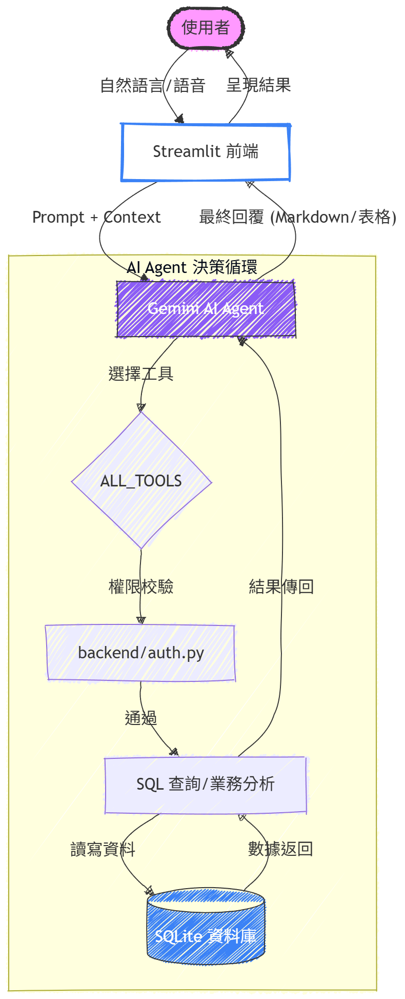

# AI Risk-Based Inventory ERP System
AI 風險導向智慧庫存 ERP 系統

本專案為一個結合 **人工智慧 (AI)** 與 **企業資源管理系統 (ERP)** 的智慧管理平台，
透過分析企業營運資料、庫存資訊與供應鏈風險，
協助企業進行 **智慧決策、庫存管理與風險預測**。

本系統整合 ERP 管理模組、AI 風險分析與數據視覺化，
提供企業完整的營運管理解決方案。

---

# 系統特色

- AI 庫存風險分析
- ERP 企業管理系統
- 供應鏈風險監測
- ESG 與碳排放管理
- AI 智慧助理
- 即時營運 Dashboard

---

# 系統架構

```
            ┌──────────────┐
            │   AI Agent   │
            │ Risk Analysis│
            └──────┬───────┘
                   │
        ┌──────────▼──────────┐
        │      ERP System     │
        │ Inventory / Orders  │
        │ Procurement / HR    │
        │ Finance / ESG       │
        └──────────┬──────────┘
                   │
             ┌─────▼─────┐
             │ Database  │
             │  SQLite   │
             └───────────┘
```

---

# 系統功能

## 1. ERP 管理系統

系統提供完整企業管理模組：

- 庫存管理 (Inventory)
- 訂單管理 (Orders)
- 採購管理 (Procurement)
- 人力資源管理 (HR)
- 財務管理 (Finance)
- 製造管理 (Manufacturing)

---

## 2. AI 供應鏈風險分析

透過 AI 技術分析供應鏈與市場資訊：

- 供應鏈風險評估
- 市場新聞分析
- 風險預警
- 決策建議

---

## 3. ESG 與碳排放管理

企業永續經營分析：

- 碳排放監控
- ESG 指標分析
- 永續發展評估

---

## 4. AI 智慧助理

AI 助理可協助：

- 查詢 ERP 資料
- 分析企業營運狀況
- 提供決策建議

---

# 技術架構

本系統使用以下技術：

-核心程式語言：全面採用 Python 進行底層邏輯開發。
-Web 應用框架與互動套件：使用 Streamlit 框架實現快速的數據視覺化，並導入 streamlit-mic-recorder 語音-轉文字（Speech-to-Text）組件，支援跨瀏覽器的即時語音捕捉能力。
-人工智慧模型引擎：介接 Google Gemini API，利用其優異的語義理解與函式調用（Function Calling）能力驅動核心邏輯。
-外部資料來源：串接 GNews API，獲取全球即時新聞作為風險預警的資訊基底。
-核心資料庫系統：選用 SQLite 作為結構化數據的絕對儲存中心，確保交易紀錄的 ACID 特性與存取效率。
-資料視覺化套件：整合 Plotly 與 Matplotlib 庫，將抽象數據轉化為直觀圖表。

---

# 專案結構

```
AI-Risk-Based-Inventory-ERP
│
├── app.py
│
├── frontend
│   ├── page_dashboard.py
│   ├── page_inventory.py
│   ├── page_sales.py
│   ├── page_procurement.py
│   ├── page_hr.py
│   ├── page_finance.py
│   ├── page_carbon.py
│   ├── page_esg.py
│   └── page_ai_assistant.py
│
├── backend
│   ├── database.py
│   ├── inventory.py
│   ├── orders.py
│   ├── procurement.py
│   ├── hr.py
│   ├── finance.py
│   ├── manufacturing.py
│   ├── supply_chain_risk.py
│   └── supply_chain_news.py
│
├── data
│   └── erp.db
│
└── README.md
```

---

# 系統畫面


---

# 未來發展

未來可擴展：

- AI 需求預測
- 自動補貨系統
- AI 供應鏈預測模型
- ERP SaaS 平台
- LINE Bot 整合

---

# 專案作者

本專案為競賽作品，由團隊共同開發完成。
